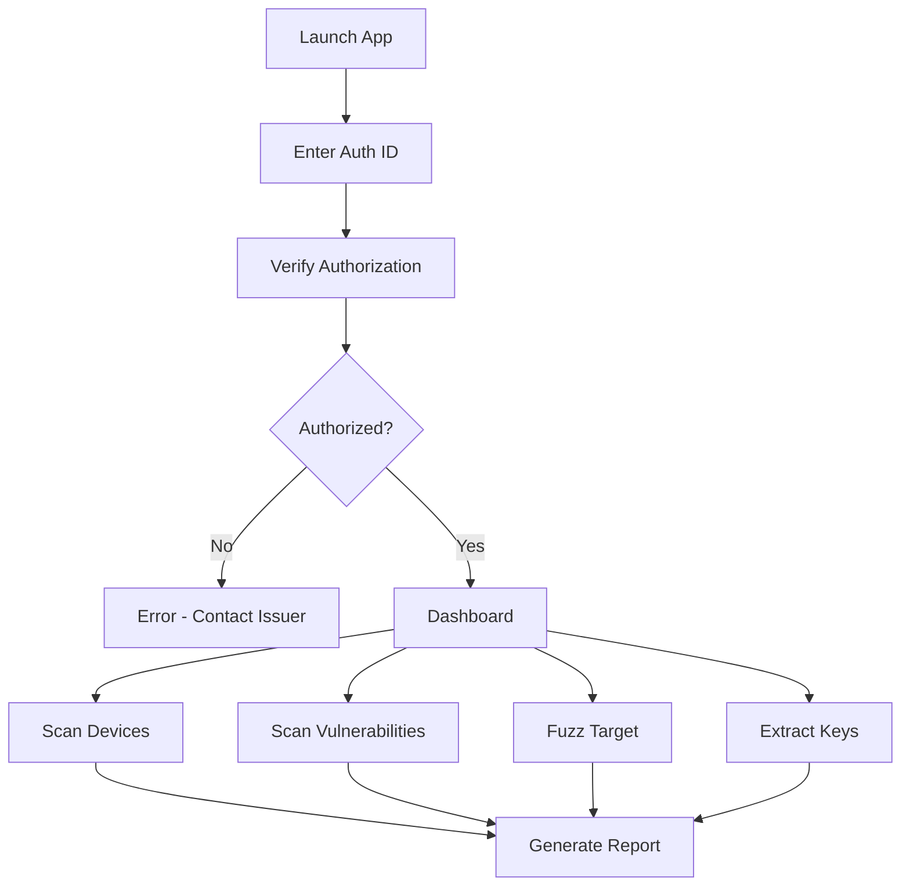

# BTSec Test Tool - Android Bluetooth Security Testing Application

[](https://github.com/xarlord/btsec-testtool/actions/workflows/ci.yml)
[](https://github.com/xarlord/btsec-testtool/blob/main/TEST_COVERAGE_REPORT.md)
[](LICENSE)
[](https://github.com/xarlord/btsec-testtool/releases/tag/v1.0.0)

**Version:** 1.0.0
**Status:** Planning Complete - Ready for Implementation
**Last Updated:** February 7, 2026

---

## ⚠️ CRITICAL NOTICE

**This application is designed EXCLUSIVELY for AUTHORIZED security testing.**

Unauthorized use of this application is:
- **Illegal** under computer fraud laws (CFAA, EU NIS2, and similar laws worldwide)
- **Unethical** and violates professional security research standards
- **Potentially harmful** to systems, data, and users

**If you do not have explicit written authorization to test a target system, DO NOT USE THIS APPLICATION.**

---

## Table of Contents

1. [Overview](#overview)
2. [Features](#features)
3. [Requirements](#requirements)
4. [Architecture](#architecture)
5. [Installation](#installation)
6. [Quick Start](#quick-start)
7. [User Guide](#user-guide)
8. [API Reference](#api-reference)
9. [Legal & Ethics](#legal--ethics)
10. [Documentation](#documentation)
11. [Contributing](#contributing)
12. [License](#license)
13. [Support](#support)

---

## Overview

BTSec Test Tool is an Android application designed for authorized security testing of Bluetooth vulnerabilities. It provides security researchers with tools to:

- Scan and enumerate Bluetooth devices
- Test for known vulnerabilities (CVEs)
- Perform protocol fuzzing
- Analyze Bluetooth key material
- Generate comprehensive security reports

### Target Audience

- **Security Researchers** conducting authorized penetration testing
- **Red Teams** performing security assessments
- **Bluetooth Developers** testing their implementations
- **Organizations** auditing their Bluetooth infrastructure

### What This Tool Does

| Capability | Description |
|------------|-------------|
| **Device Scanning** | Discover and enumerate nearby Bluetooth devices |
| **Vulnerability Scanning** | Check targets for known CVEs (KNOB, BIAS, BLESA, etc.) |
| **Protocol Fuzzing** | Send malformed packets to discover vulnerabilities |
| **Key Analysis** | Assess Bluetooth key material strength and extraction feasibility |
| **Report Generation** | Create professional security assessment reports |

### What This Tool Does NOT Do

- ✗ Exploit vulnerabilities for malicious purposes
- ✗ Extract encryption keys without authorization
- ✗ Attack devices without explicit consent
- ✗ Bypass authorization requirements
- ✗ Provide root/exploit kits for malicious use

---

## Features

### Core Features

#### 1. Authorization System
- **Mandatory written authorization** before any testing
- **Scope enforcement** - tests limited to authorized targets
- **Consent tracking** - all actions logged for audit
- **Digital signatures** - authorization documents cryptographically verified

#### 2. Device Scanner
- BLE and Classic Bluetooth device discovery
- Device fingerprinting and classification
- Pairing status detection
- Signal strength analysis
- Service enumeration (where supported)

#### 3. Vulnerability Scanner
- Database of known Bluetooth CVEs (2020-2026)
- Patch level detection
- Automated vulnerability testing
- CVSS v3.1 scoring
- Remediation recommendations

**Vulnerabilities Tested:**
| CVE | Vulnerability | Severity |
|-----|--------------|----------|
| CVE-2019-9506 | KNOB Attack | HIGH |
| CVE-2020-0022 | BlueZoom | CRITICAL |
| CVE-2020-26555 | BIAS | HIGH |
| CVE-2024-23717 | Bluetooth Privilege Escalation | HIGH |
| CVE-2024-34719 | Permissions Bypass | HIGH |
| CVE-2024-43093 | Active Exploitation | CRITICAL |
| CVE-2025-20700-02 | Airoha RACE | HIGH |
| CVE-2025-36911 | WhisperPair | MEDIUM |

#### 4. Key Extraction Analysis
- **IRK (Identity Resolving Key)** extraction attempts
- **LTK (Long Term Key)** analysis
- **CSRK (Connection Signature Resolving Key)** assessment
- **Link Key** (Classic Bluetooth) evaluation
- Entropy calculation and pattern detection
- **KNOB downgrade attack** testing

#### 5. Fuzzing Engine
- **Protocol-specific fuzzers:** GATT, SMP, L2CAP, SDP, RFCOMM
- **Mutation strategies:** Bit flip, byte flip, arithmetic overflow, boundary values
- **Rate limiting:** Configurable packets per second
- **Crash detection:** Automatic detection of device crashes
- **Safe operation:** Stops on critical findings

#### 6. Reporting Module
- **Executive Summary** for stakeholders
- **Technical Findings** with reproduction steps
- **CVSS v3.1 Scoring** with detailed metrics
- **Remediation Guidance** with prioritization
- **Export formats:** JSON, PDF, HTML

### Advanced Features

#### Packet Capture
- Capture Bluetooth packets for analysis
- Filter by protocol, device, or custom criteria
- Export in PCAP format

#### Custom Test Modules
- Extensible architecture for custom tests
- Plugin system for community contributions
- Scriptable test sequences

#### Team Collaboration
- Share authorization with team members
- Collaborative testing sessions
- Centralized result aggregation

---

## Requirements

### System Requirements

| Requirement | Minimum | Recommended |
|-------------|---------|--------------|
| **Android Version** | 7.0 (API 24) | 13.0 (API 33) |
| **RAM** | 2 GB | 4 GB |
| **Storage** | 100 MB free | 500 MB free |
| **Bluetooth** | BLE + Classic | BLE 5.0+ |
| **Location** | GPS required | GPS required |

### Permissions

The application requires the following permissions:

```xml
<!-- Android 12+ Permissions -->
<uses-permission android:name="android.permission.BLUETOOTH_CONNECT" />
<uses-permission android:name="android.permission.BLUETOOTH_SCAN" />
<uses-permission android:name="android.permission.BLUETOOTH_ADVERTISE" />

<!-- Location (Required for scanning) -->
<uses-permission android:name="android.permission.ACCESS_FINE_LOCATION" />
<uses-permission android:name="android.permission.ACCESS_COARSE_LOCATION" />

<!-- Android 13+ -->
<uses-permission android:name="android.permission.NEARBY_WIFI_DEVICES" />

<!-- Optional (for enhanced features) -->
<uses-permission android:name="android.permission.INTERNET" />
<uses-permission android:name="android.permission.WRITE_EXTERNAL_STORAGE" />
```

### Hardware Requirements

**Optional hardware for advanced testing:**
- Ubertooth One for packet capture
- Nordic nRF Sniffer for BLE analysis
- External Bluetooth adapter for Classic Bluetooth

---

## Architecture

### Technology Stack

| Layer | Technology | Purpose |
|-------|-----------|---------|
| **Language** | Kotlin 1.9+ | Primary development language |
| **UI Framework** | Jetpack Compose | Modern declarative UI |
| **Architecture** | MVVM + Clean Architecture | Testability, separation of concerns |
| **Async** | Coroutines + Flow | Reactive operations |
| **DI** | Hilt 2.48+ | Dependency injection |
| **Database** | Room 2.6+ | Local persistence |
| **Serialization** | Kotlinx Serialization | JSON/data handling |

### Module Structure

```
app/
├── presentation/          # Compose UI + ViewModels
│   ├── feature/
│   │   ├── authorization/ # Authorization flow
│   │   ├── scanner/        # Device scanning UI
│   │   ├── fuzzer/         # Fuzzing interface
│   │   ├── keyextraction/  # Key analysis UI
│   │   ├── vulnscanner/    # Vulnerability scanner UI
│   │   └── reports/        # Report viewing/generation
│   └── common/             # Shared UI components
├── domain/                 # Business logic
│   ├── model/              # Domain models
│   ├── repository/         # Repository interfaces
│   └── usecase/            # Use cases
└── data/                   # Data layer
    ├── bluetooth/          # Bluetooth operations
    ├── fuzzing/            # Fuzzing engine
    ├── keys/               # Key extraction
    ├── vulns/              # Vulnerability database
    └── reports/            # Report generation
```

### Data Flow

```
User Input (UI)
    ↓
ViewModel
    ↓
Use Case (verifies authorization)
    ↓
Repository (enforces scope)
    ↓
Bluetooth/API Operations
    ↓
Results (logged for audit)
    ↓
Report Generation
```

---

## Installation

### For Users

**From Google Play Store (when published):**
1. Open Google Play Store
2. Search for "BTSec Test Tool"
3. Install the application
4. Grant required permissions when prompted

**From APK:**
1. Download the latest APK from the releases page
2. Enable "Install from Unknown Sources" in device settings
3. Open the APK file to install
4. Grant required permissions when prompted

### For Developers

**Building from source:**

```bash
# Clone the repository
git clone https://github.com/your-org/bt-pennetration-app.git
cd bt-pennetration-app

# Ensure you have JDK 17 installed
java -version

# Build the project
./gradlew assembleDebug

# Install on connected device
./gradlew installDebug

# Or generate a release APK
./gradlew assembleRelease
```

**Requirements:**
- JDK 17 or higher
- Android SDK 34
- Android Studio Hedgehog or later

---

## Quick Start

### First-Time Setup

1. **Launch the Application**

2. **Review Legal Notices**
   - Read the terms of service carefully
   - Understand that authorization is MANDATORY

3. **Enter Authorization ID**
   - Format: `BTSEC-YYYYMMDD-XXXXXXXX`
   - Example: `BTSEC-20260207-A1B2C3D4`
   - You must have a valid authorization document

4. **Review Testing Scope**
   - Verify authorized targets
   - Confirm allowed test types
   - Note time constraints

5. **Grant Consent**
   - Accept the terms of service
   - Acknowledge legal requirements
   - Confirm understanding of scope

### Basic Workflow



---

## User Guide

### Authorization

**How to Obtain Authorization:**

1. Contact the target system owner
2. Provide written request for security testing
3. Specify testing scope and duration
4. Receive signed authorization document
5. Register authorization to receive Auth ID

**Authorization ID Format:**
```
BTSEC-YYYYMMDD-XXXXXXXX

Example: BTSEC-20260207-A1B2C3D4
         │      │        │
         │      │        └─ Unique identifier (8 chars)
         │      └────────── Date issued (YYYYMMDD)
         └───────────────── Fixed prefix
```

### Device Scanning

**To scan for Bluetooth devices:**

1. Navigate to **Scanner** from dashboard
2. Review authorization scope for permitted scanning
3. Tap **Start Scan**
4. Grant location permission if prompted
5. View discovered devices in real-time

**Device Information Displayed:**
- Name/alias
- MAC address
- Device type (BLE/Classic/Dual)
- Device class (Phone, Audio, IoT, etc.)
- Pairing status
- Signal strength (RSSI)

**Scanning Options:**
- Filter by device type
- Filter by signal strength
- Filter by name pattern
- Auto-scan interval
- Scan duration

### Vulnerability Scanning

**To scan a device for vulnerabilities:**

1. Navigate to **Vulnerability Scanner**
2. Select target device from scanned list
3. Tap **Scan for Vulnerabilities**
4. Review scan progress
5. View results when complete

**Vulnerability Report Includes:**
- CVE ID and name
- CVSS v3.1 score
- Exploitability status
- Affected components
- Remediation recommendations
- References for further reading

**Filter Options:**
- By severity (Critical, High, Medium, Low)
- By exploitability
- By CVE
- By date

### Fuzzing

**To fuzz a Bluetooth device:**

⚠️ **WARNING:** Fuzzing can cause devices to crash or behave unexpectedly. Ensure:
- Authorization permits fuzzing
- Device is not critical infrastructure
- Fuzzing is within authorized scope

1. Navigate to **Fuzzer**
2. Configure fuzzing parameters:
   - Target device
   - Protocol (GATT, SMP, L2CAP, etc.)
   - Mutation strategy
   - Packets per second (1-100)
   - Max duration
   - Stop on crash option
3. Tap **Start Fuzzing**
4. Monitor real-time results
5. Stop manually or when complete

**Fuzzing Results:**
- Packets sent
- Responses received
- Anomalies detected
- Crashes found
- Reproduction steps

### Key Extraction

**To analyze Bluetooth keys:**

⚠️ **WARNING:** Key extraction requires explicit authorization. Ensure your authorization permits this activity.

1. Navigate to **Key Extraction**
2. Select target device
3. Choose extraction methods:
   - IRK Error Induction
   - LTK Analysis
   - CSRK Signature Analysis
   - KNOB Downgrade
4. Tap **Start Analysis**
5. Review results

**Key Analysis Results:**
- Keys found (if any)
- Entropy scores
- Pattern detection
- Strength assessment
- Recommendations

### Reports

**To generate a security report:**

1. Navigate to **Reports**
2. Select report type:
   - Executive Summary
   - Technical Findings
   - Vulnerability Report
   - Key Analysis Report
   - Fuzzing Report
3. Choose data to include
4. Select export format (PDF, JSON, HTML)
5. Tap **Generate Report**
6. Share or save the report

**Report Contents:**
- Metadata (date, tester, scope)
- Executive summary
- Target information
- Findings with CVSS scores
- Technical details
- Remediation recommendations
- Appendix with raw data

---

## API Reference

### Core Interfaces

#### AuthorizationManager

```kotlin
interface AuthorizationManager {
    /**
     * Verifies an authorization ID is valid and current
     * @param authId Authorization ID (format: BTSEC-YYYYMMDD-XXXXXXXX)
     * @return Result containing Authorization if valid
     */
    suspend fun verifyAuthorization(authId: String): Result<Authorization>

    /**
     * Checks if an action is authorized for a specific target
     * @param authId Authorization ID
     * @param action Test action to perform
     * @param target Target device (optional)
     * @return true if authorized, false otherwise
     */
    suspend fun checkAuthorized(
        authId: String,
        action: TestAction,
        target: TargetDevice? = null
    ): Boolean
}
```

#### BluetoothManager

```kotlin
interface BluetoothManager {
    /**
     * Initialize Bluetooth adapter
     * @return Result indicating success or failure
     */
    suspend fun initialize(): Result<Unit>

    /**
     * Start scanning for Bluetooth devices
     * @param authId Authorization ID
     * @param filter Optional scan filter
     * @return Flow of discovered devices
     */
    suspend fun startScan(
        authId: String,
        filter: ScanFilter?
    ): Flow<BluetoothDevice>

    /**
     * Stop scanning
     * @return Result indicating success or failure
     */
    suspend fun stopScan(): Result<Unit>

    /**
     * Connect to a Bluetooth device
     * @param authId Authorization ID
     * @param device Device to connect
     * @return Flow of connection state updates
     */
    suspend fun connect(
        authId: String,
        device: BluetoothDevice
    ): Flow<ConnectionState>
}
```

#### VulnerabilityScanner

```kotlin
interface VulnerabilityScanner {
    /**
     * Scan a device for known vulnerabilities
     * @param authId Authorization ID
     * @param device Device to scan
     * @return VulnerabilityReport with findings
     */
    suspend fun scanDevice(
        authId: String,
        device: BluetoothDevice
    ): VulnerabilityReport

    /**
     * Update the vulnerability database
     * @return Result indicating success or failure
     */
    suspend fun updateDatabase(): Result<Unit>
}
```

#### FuzzingEngine

```kotlin
interface FuzzingEngine {
    /**
     * Configure fuzzing parameters
     * @param authId Authorization ID
     * @param config Fuzzing configuration
     * @return Result indicating success or failure
     */
    suspend fun configure(
        authId: String,
        config: FuzzConfig
    ): Result<Unit>

    /**
     * Start fuzzing a target device
     * @param authId Authorization ID
     * @return Flow of fuzzing results
     */
    suspend fun startFuzzing(
        authId: String
    ): Flow<FuzzResult>

    /**
     * Stop fuzzing
     * @return Result indicating success or failure
     */
    suspend fun stopFuzzing(): Result<Unit>
}
```

### Data Models

#### Authorization

```kotlin
data class Authorization(
    val authId: String,              // BTSEC-YYYYMMDD-XXXXXXXX
    val issuedTo: String,            // Authorized tester
    val issuedBy: String,            // Authorizing organization
    val issuedDate: LocalDate,       // Date issued
    val validFrom: LocalDateTime,    // When testing may begin
    val validUntil: LocalDateTime,   // When testing must end
    val authorizedTargets: List<TargetDevice>,
    val allowedActions: Set<TestAction>,
    val scope: TestScope,
    val signature: String            // Digital signature
)
```

#### BluetoothDevice

```kotlin
data class BluetoothDevice(
    val address: String,             // MAC address
    val name: String?,               // Device name
    val type: DeviceType,            // BLE, CLASSIC, DUAL_MODE
    val deviceClass: DeviceClass,
    val bondState: BondState,        // NONE, BONDING, BONDED
    val rssi: Int?,                  // Signal strength
    val timestamp: Long
)
```

#### Vulnerability

```kotlin
data class Vulnerability(
    val cveId: String,
    val name: String,
    val description: String,
    val publishedDate: LocalDate,
    val severity: CvssScore,
    val affectedVersions: VersionRange,
    val exploitAvailable: Boolean,
    val references: List<String>
)
```

---

## Legal & Ethics

### Authorization Requirements

**MANDATORY:**

1. **Written authorization** from system owner before testing
2. **Clear scope definition** of what will be tested
3. **Time constraints** specifying when testing may occur
4. **Explicit consent** for each type of test
5. **Digital signature** on authorization document

**Authorization Template:**

See `legal_ethical_framework.md` for the complete authorization template.

### Responsible Disclosure

**Timeline:**

| Day | Action |
|-----|--------|
| 0 | Discovery |
| 1 | Private disclosure to vendor |
| 7 | Vendor acknowledgment deadline |
| 30-60 | Patch development |
| 90 | Public disclosure (standard) |
| 90+ | Extended disclosure (if needed) |

**Requirements:**

- No public disclosure before agreed date
- Coordinated disclosure with vendor
- Allow reasonable patch period
- Provide detailed findings to vendor

### Scope Limitations

**The application enforces:**

- Target device restrictions
- Action type restrictions
- Time-based restrictions
- Rate limiting
- Scope violation detection

**Violations result in:**

- Warning for minor violations
- Operation stop for medium violations
- Authorization revocation for serious violations
- Reporting to authorities for illegal activity

### Data Retention

**All testing data is retained for:**
- **Minimum:** 7 years
- **Purpose:** Audit trail, legal compliance
- **Storage:** Encrypted at rest
- **Access:** Logged and restricted

---

## Documentation

### Project Documentation

| Document | Description | Location |
|----------|-------------|----------|
| Task Plan | Project roadmap and progress | `task_plan.md` |
| Findings | Research findings and requirements | `findings.md` |
| Architecture | System architecture design | `architecture.md` |
| Implementation Plan | Detailed implementation specs | `implementation_plan.md` |
| Legal Framework | Legal and ethical guidelines | `legal_ethical_framework.md` |
| This README | User and developer guide | `README.md` |

### API Documentation

Full API documentation is available at:
- **Online:** https://btsec-tool.example.com/api/
- **Offline:** Included in the app (Help → API Reference)

### Code Documentation

- **KDoc:** All public APIs are documented with KDoc
- **Comments:** Complex algorithms have inline comments
- **Examples:** Usage examples in documentation

---

## Contributing

### How to Contribute

We welcome contributions from the security research community!

**Contribution Areas:**
- New vulnerability tests
- Additional mutation strategies
- Protocol fuzzers
- Bug fixes
- Documentation improvements
- Translation

**Contribution Guidelines:**

1. **Fork** the repository
2. **Create a feature branch** (`git checkout -b feature/amazing-feature`)
3. **Commit** your changes (`git commit -m 'Add amazing feature'`)
4. **Push** to the branch (`git push origin feature/amazing-feature`)
5. **Open a Pull Request**

**Contribution Requirements:**

- All code must follow the code style guidelines
- Unit tests with 80%+ coverage
- Documentation for new features
- Security review passed

### Development Setup

```bash
# Clone your fork
git clone https://github.com/YOUR-USERNAME/bt-pennetration-app.git
cd bt-pennetration-app

# Add upstream remote
git remote add upstream https://github.com/original-org/bt-pennetration-app.git

# Create a new branch
git checkout -b feature/my-feature

# Make your changes
# ...

# Run tests
./gradlew test

# Run lint
./gradlew lint

# Commit your changes
git commit -m "Add my feature"

# Push to your fork
git push origin feature/my-feature
```

---

## License

```
BTSec Test Tool - Android Bluetooth Security Testing Application
Copyright (c) 2026 Security Research Team

This application is licensed under the MIT License with additional restrictions:

RESTRICTIONS:
1. This application may ONLY be used for authorized security testing
2. Commercial use requires explicit written permission
3. Modification to bypass authorization is prohibited
4. Distribution must include this LICENSE and all legal notices

MIT License:

Permission is hereby granted, free of charge, to any person obtaining a copy
of this software and associated documentation files (the "Software"), to deal
in the Software without restriction, including without limitation the rights
to use, copy, modify, merge, publish, distribute, sublicense, and/or sell
copies of the Software, and to permit persons to whom the Software is
furnished to do so, subject to the following conditions:

The above copyright notice and this permission notice shall be included in all
copies or substantial portions of the Software.

THE SOFTWARE IS PROVIDED "AS IS", WITHOUT WARRANTY OF ANY KIND, EXPRESS OR
IMPLIED, INCLUDING BUT NOT LIMITED TO THE WARRANTIES OF MERCHANTABILITY,
FITNESS FOR A PARTICULAR PURPOSE AND NONINFRINGEMENT. IN NO EVENT SHALL THE
AUTHORS OR COPYRIGHT HOLDERS BE LIABLE FOR ANY CLAIM, DAMAGES OR OTHER
LIABILITY, WHETHER IN AN ACTION OF CONTRACT, TORT OR OTHERWISE, ARISING FROM,
OUT OF OR IN CONNECTION WITH THE SOFTWARE OR THE USE OR OTHER DEALINGS IN THE
SOFTWARE.
```

### Third-Party Licenses

This application uses the following third-party libraries:

| Library | License | Purpose |
|---------|---------|---------|
| AndroidX | Apache 2.0 | Android framework |
| Jetpack Compose | Apache 2.0 | UI framework |
| Hilt | Apache 2.0 | Dependency injection |
| Room | Apache 2.0 | Database |
| Kotlinx Coroutines | Apache 2.0 | Async operations |
| iText 7 | AGPL | PDF generation |

See `THIRD_PARTY_LICENSES.md` for full license text.

---

## Support

### Getting Help

**Documentation:**
- README (this file)
- API Reference
- Legal Framework Guide

**Community:**
- GitHub Issues: https://github.com/your-org/bt-pennetration-app/issues
- Discussions: https://github.com/your-org/bt-pennetration-app/discussions
- Security Advisories: https://github.com/your-org/bt-pennetration-app/security

**Professional Support:**
- Email: support@btsec-tool.example.com
- Documentation: https://docs.btsec-tool.example.com
- Training: https://training.btsec-tool.example.com

### Reporting Issues

When reporting issues, please include:

1. **Android version and device model**
2. **Application version**
3. **Steps to reproduce**
4. **Expected behavior**
5. **Actual behavior**
6. **Logs (if applicable)**

### Security Issues

**For security vulnerabilities:**

Do NOT use GitHub issues. Instead:

1. Email: security@btsec-tool.example.com
2. Include "Security Vulnerability" in subject
3. Use our PGP key for sensitive information
4. Allow 90-day disclosure timeline

**PGP Key:**
```
-----BEGIN PGP PUBLIC KEY BLOCK-----
[PGP key here]
-----END PGP PUBLIC KEY BLOCK-----
```

### Responsible Disclosure

We follow coordinated disclosure:
- 90-day disclosure timeline
- Credit to discoverers
- Vendor coordination
- Public disclosure after patch

---

## Acknowledgments

### Research Contributors

- **Security Research Community** - For vulnerability research
- **Bluetooth SIG** - For protocol specifications
- **Android Security Team** - For platform improvements
- **Academic Researchers** - For Bluetooth security papers

### Open Source Projects

This application builds upon:
- Android Open Source Project
- BlueZ Bluetooth stack
- InternalBlue framework
- BLE security research tools

### Legal Disclaimer

**THIS APPLICATION IS PROVIDED FOR AUTHORIZED SECURITY TESTING ONLY.**

The developers:
- Are not responsible for unauthorized use
- Do not condone illegal activity
- Encourage responsible disclosure
- Support ethical security research

Use of this application for unauthorized testing is:
- Illegal in most jurisdictions
- Unethical
- Potentially harmful

**Always obtain explicit written authorization before testing.**

---

## Version History

| Version | Date | Changes |
|---------|------|---------|
| 1.0.0 | 2026-02-07 | Initial release planning |

---

## Roadmap

### Planned Features

**Version 1.1 (Q2 2026):**
- [ ] Additional vulnerability tests
- [ ] Improved packet capture
- [ ] Custom test scripting
- [ ] Team collaboration features

**Version 1.2 (Q3 2026):**
- [ ] Wear OS companion app
- [ ] Cloud sync for teams
- [ ] API for automation
- [ ] Advanced reporting

**Version 2.0 (Q4 2026):**
- [ ] Machine learning for anomaly detection
- [ ] Automated exploit generation
- [ ] Integration with bug bounty platforms
- [ ] Training and certification program

---

**Document Version:** 1.0
**Last Updated:** February 7, 2026
**Status:** Ready for Implementation

---

*For detailed technical documentation, see the other planning documents in this repository.*
